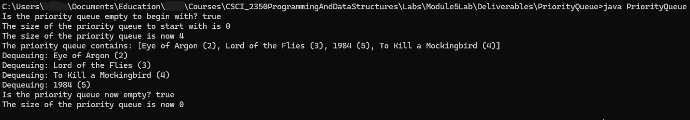

# PriorityQueue
PriorityQueue uses a custom MyArrayList that extends AbstractList and implements a List interface. In turn, MyArrayList is used to create MyHeap, which extends Comparable and implements Heap. PriorityQueue implements Queue and uses MyHeap by composition to store objects. As objects are dequeued from the PriorityQueue, they are listed in ascending order since that is how they are stored in the heap's tree structure.

## Table of contents
* [General Info](#General-info)
* [Author](#Author)
* [Programming Approaches](#Programming-approaches)
* [Techologies](#Technologies)
* [Setup](#Setup)
* [Usage](#Usage)
* [Minimum hardware requirements](#Minimum-hardware-requirements)
* [Screenshots](#Screenshots)
* [Project status](#Project-status)
* [Release date](#Release-date)
* [Sources](#Sources)
* [Works Cited](#Works-Cited)
* [Acknowledgements](#Acknowledgements)
* [Contact](#Contact)
* [Disclaimer](#Disclaimer)

## General info
- The PriorityQueue is tested with a separate internal class called Book that implements Comparable by comparing whether a Book's rating is less than another Book's rating by subtracting the other Book's rating from the first Book's rating. 
- PriorityQueue creates four book objects, enqueues them on the priority queue that uses a heap as its implementation, and when they are dequeued, the books are listed in ascending order by rating since that is how they are stored in the heap's tree structure.
- The program displays the heap/priorityQueue as a string before displaying the dequeued books.

## Author
- Jason Ash, Computer Science Major

## Programming approaches
- My implementation for List, AbstractList, and MyArrayList closely follows what is in our textbook (Liang, 2024) since they use generics but not comparable or iterator.
- I also followed a suggestion in the third chapter on sorted and unsorted lists in *Object-Oriented Data Structures* by N. Dale, D.T. Joyce, and C. Weems on returning a copy of the object that was gotten or removed from a list to ensure information hiding and better encapsulation.
- MyHeap is mostly based on LiveExample 23.9 in our textbook (Liang, 2024).
- The Heap interface that I made is very simple because it only defines four methods that MyHeap needs to implement: add (E objects), remove(), getSize(), and isEmpty().
- The peek() method was removed from this version of the Queue interface because it wasn't needed in this implementation.
- PriorityQueue calls on respective Heap methods to accomplish its tasks.
- For example, enqueue() calls heap.add() and dequeue calls heap.remove().
- Since the program uses generics (which is a beneficial programming technique), the compiler will complain that PriorityQueue.java uses unchecked or unsafe operations (which is just its way of saying it cannot guarantee type casting of objects into their actual type, such as Book).
- There is no way to prevent or suppress this message when using generics, but Java bytecode is still compiled into classes within the directory that PriorityQueue.java is saved to, and the program can still be run with the javac command.

## Technologies:
I wrote the source code in Notepad in Windows 11, compiled it in the Command Prompt using the javac command, and ran it using the java command.

## Setup
To compile this .java file into Java bytecode, you can use the command line like I did or your favorite IDE of choice.

## Usage
- Type java PriorityQueue in the command line after compiling it, and the output should be the same as the screenshot below.

## Minimum hardware requirements
- Although I developed this on a fairly recent Windows 11 PC, this program should run comfortably on any working computer with sufficient processing power, RAM, a monitor manufactured within the past 15-20 years, and an Internet connection to download the .java source file.
- I used JDK version 21 to compile this source code, so your computer will have to be capable of installing and running that version of the JDK and its corresponding built-in JRE.

## Screenshots

## Project status
- This program met or exceeded the requirements for this part of Lab 5, so I'm releasing my solution on GitHub.

## Release date
19 Aug, 2026

## Sources
- I was having trouble with the compiler since it could not find symbol Comparable or <E>, so I asked https://deepai.org/chat/ai-code#3297b278-b6dc-4357-8193-541a907b991b "why can't the javac compiler find the symbol Comparator and <E>?" and it suggested using <E extends Comparable<E>> at the top of the class (which I discovered later the Professor had in his template for PriorityQueue, so I should have looked there first for that clue), and using Comparable<? super E> instead of Comparable<E> in the constructors. After asking it to "Please help me rewrite the constructor with proper constraints.", it next suggested to this.c = (e1, e2) -> e1.compareTo(e2)); in the constructors instead of the commented-out line that it first suggested.
- MyHeap is implemented according to the mathematical formula in Chapter 23.6.1 of our textbook "Storing a Heap" that says, "For a node at position i, its left child is at position 2i + 1, and its right child is at position 2i + 2, and its parent is (i - 1) / 2." (Liang, 2024).

## Works Cited
- Dale, Nell, Joyce, Daniel T., and Weems, Chip. *Object-Oriented Data Structures Using Java*. Jones and Bartlett Learning, 2002.

- Liang, Y. Daniel. *Introduction to Java Programming and Data Structures*. 13th ed., Pearson Education Limited, 2024.

- https://deepai.org/chat/ai-code#3297b278-b6dc-4357-8193-541a907b991b chat to help with the beginning of the MyHeap class and its constructors.

## Acknowledgements
- Prof. Dr. Ibrahim AL-Agha is the project advisor.

## Contact
Jason Ash - wizardofki@gmail.com

## Disclaimer
PriorityQueue.java is released under the GNU Public License 3.0. This software and source code are expressly provided "AS IS." I (Jason Ash) MAKE NO WARRANTY OF ANY KIND, EXPRESS, IMPLIED, IN FACT, OR ARISING BY OPERATION OF LAW, INCLUDING, WITHOUT LIMITATION, THE IMPLIED WARRANTY OF MERCHANTABILITY, FITNESS FOR A PARTICULAR PURPOSE, NON-INFRINGEMENT, AND DATA ACCURACY. I NEITHER REPRESENT NOR WARRANT THAT THE OPERATION OF THE SOFTWARE WILL BE UNINTERRUPTED OR ERROR-FREE, OR THAT ANY DEFECTS WILL BE CORRECTED. I DO NOT WARRANT OR MAKE ANY REPRESENTATIONS REGARDING THE USE OF THE SOFTWARE OR THE RESULTS THEREOF, INCLUDING BUT NOT LIMITED TO THE CORRECTNESS, ACCURACY, RELIABILITY, OR USEFULNESS OF THE SOFTWARE.
